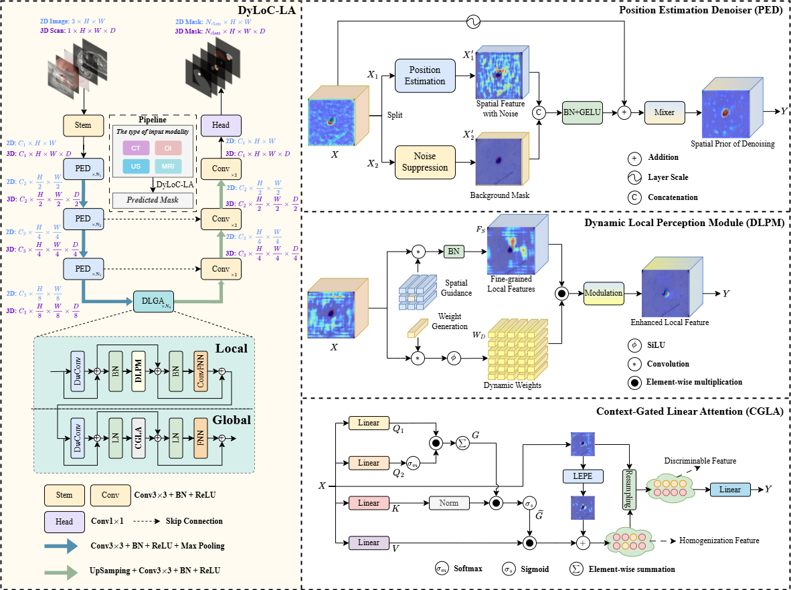
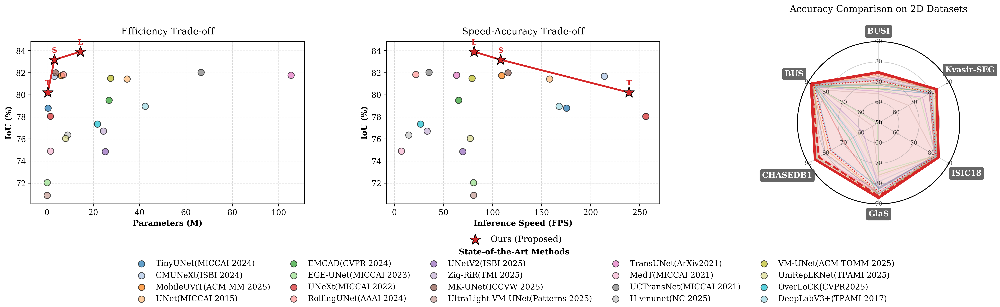
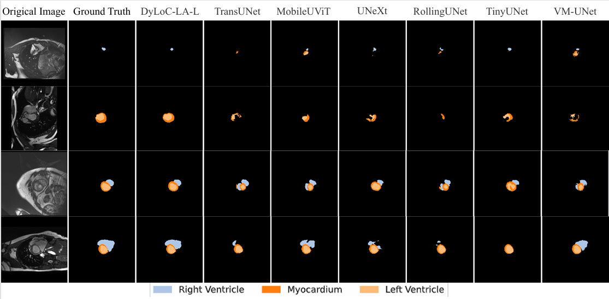
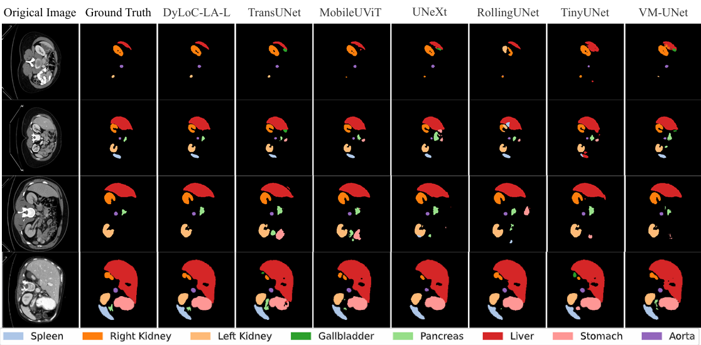

# 🚀 DyLoC-LA

Official implementation of:

**"DyLoC-LA: An Efficient Framework with Dynamic Local Perception and Context-Gated Linear Attention for Medical Image Segmentation"**

> Accepted by **ACM Multimedia 2026** 🎉

## 📌 News

- [x] 🎉 Our paper has been accepted by **ACM Multimedia 2026**.
- [ ] Paper will be released soon.
- [ ] Code will be released soon.
- [ ] The project page is available.

## 🌟 Abstract

Medical image segmentation remains challenging due to inherent imaging noise and spatial detail degradation caused by downsampling. Existing methods often suffer from the degradation of fine-grained details in deep network layers, while applying self-attention mechanisms to spatially large feature maps incurs prohibitive computational complexity. Furthermore, the lack of inductive biases in standard self-attention limits the representation capacity in data-limited medical segmentation scenarios. To address these challenges, we propose DyLoC-LA, an efficient framework designed to suppress noisy representations and preserve fine-grained spatial details. Specifically, DyLoC-LA comprises a Position Estimation Denoiser (PED) and a Dynamic Local-Global Aggregation (DLGA). The PED operates during the downsampling process to suppress noise and localize target regions. Within the DLGA, a Dynamic Local Perception Module (DLPM) adaptively extracts spatially contiguous local features, while a Context-Gated Linear Attention (CGLA) mechanism captures long-range dependencies, introduces inductive biases, and alleviates feature homogenization. Extensive experiments demonstrate that DyLoC-LA achieves state-of-the-art performance across ten datasets and four imaging modalities. Moreover, the proposed framework exhibits strong zero-shot generalization on five unseen datasets, validating its cross-domain robustness.

## 🏗️ Results

## 🖼️ Visualization

